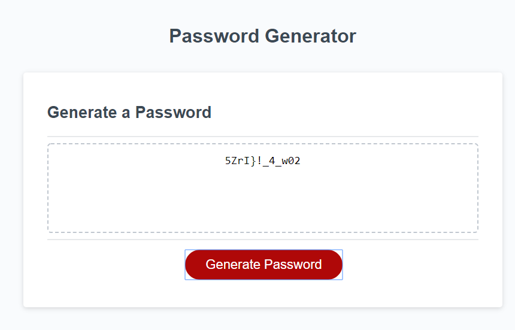

# Password Generator

[Deployed site](https://andrewjhrussell.github.io/passwordGenerator/)

Repository Github link The Github Repo is at https://github.com/Andrewjhrussell/passwordGenerator.git

Website Url: https://andrewjhrussell.github.io/passwordGenerator/

Title: Password Generator

Badges Description In this assignment,
This application generates a random password based on user-selected criteria. The app will run in the browser and feature dynamically updated HTML and CSS powered by your JavaScript code. The app is responsive and adapts to multiple screen sizes.

Table of contents Title, Description, Table Of Content, Usage, License, Contribution Test, Question, Demo

Usage This Website lets users create a password between 8 and 128 characters long for strong password security.

License MIT License

Copyright (c) 2020 Andrew Russell

Permission is hereby granted, free of charge, to any person obtaining a copy of this software and associated documentation files (the "Software"), to deal in the Software without restriction, including without limitation the rights to use, copy, modify, merge, publish, distribute, sublicense, and/or sell copies of the Software, and to permit persons to whom the Software is furnished to do so, subject to the following conditions:

The above copyright notice and this permission notice shall be included in all copies or substantial portions of the Software.

THE SOFTWARE IS PROVIDED "AS IS", WITHOUT WARRANTY OF ANY KIND, EXPRESS OR IMPLIED, INCLUDING BUT NOT LIMITED TO THE WARRANTIES OF MERCHANTABILITY, FITNESS FOR A PARTICULAR PURPOSE AND NONINFRINGEMENT. IN NO EVENT SHALL THE AUTHORS OR COPYRIGHT HOLDERS BE LIABLE FOR ANY CLAIM, DAMAGES OR OTHER LIABILITY, WHETHER IN AN ACTION OF CONTRACT, TORT OR OTHERWISE, ARISING FROM, OUT OF OR IN CONNECTION WITH THE SOFTWARE OR THE USE OR OTHER DEALINGS IN THE SOFTWARE.

Contribution Andrew Russell

Test Travis CI

If you have any questions email us @ Andrewjhrussell@gmail.com